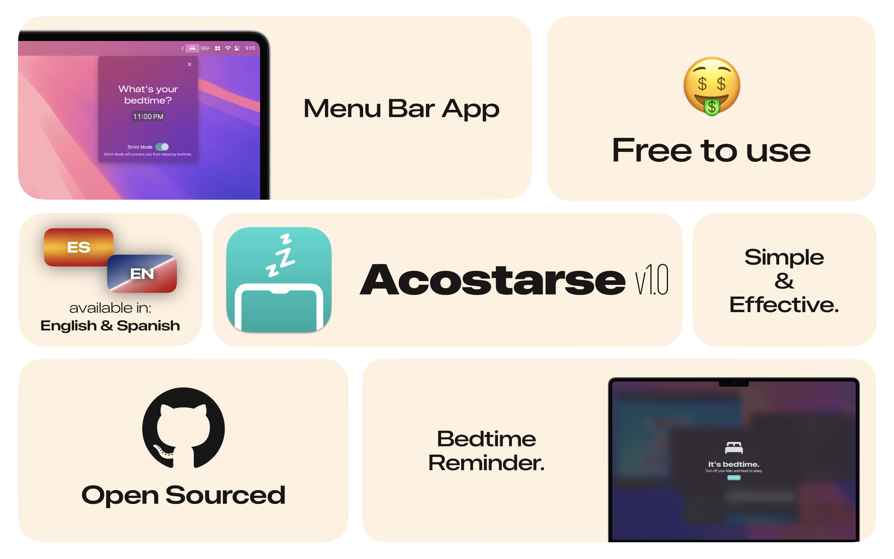

  
# Acostarse

<a href="https://apps.apple.com/in/app/bedtime-reminder-acostarse/id6746826547" target="_blank">
  
</a>

**Acostarse** is a simple yet powerful bedtime reminder app for macOS. It helps you stick to your sleep schedule by displaying a full-screen prompt when it’s time to wind down—ensuring your bedtime never slips your mind, no matter how deep into work you are.

## Features

- **Full-Screen Bedtime Alerts**: A gentle but firm nudge that’s impossible to ignore.
- **Delay Option**: Need a few more minutes to wrap up? Acostarse gives you that flexibility.
- **Strict Mode**: Disable delays entirely for a distraction-free bedtime.
- **Menu Bar Utility**: Runs quietly in your menu bar until it’s needed.
- **Quick Setup**: Configure your bedtime in under a minute.
- **Localized Experience**: Available in both English and Spanish.
- **Privacy Focused**: No analytics or tracking—your data stays on your device.

## Installation

To build the project locally:

1. **Clone the repository:**
    ```bash
    git clone https://github.com/OmChachad/acostarse.git
    ```
2. **Navigate to the project directory:**
    ```bash
    cd acostarse
    ```
3. **Open the project in Xcode:**
    ```bash
    open Acostarse.xcodeproj
    ```
4. **Install dependencies:**
    Ensure all Swift Package Manager dependencies are resolved.

5. **Build and run the project:**
    - Select the Acostarse target.
    - Choose your Mac device.
    - Click the Run button or press `Cmd + R`.

Download Acostarse from the [Mac App Store](https://apps.apple.com/in/app/bedtime-reminder-acostarse/id6746826547).

## Contributing to Localization

Acostarse is localized in both English and Spanish—and we’d love to expand support to more languages with your help!

To contribute:

1. Open the localization file at:  
   `/Acostarse/Localizable.xcstrings`

2. Add or update strings in your language section, following the existing format.

3. Create a new locale section if needed (e.g., for French, use `"fr"`).

4. Once you've made your changes:
    ```bash
    git add Acostarse/Localizable.xcstrings
    git commit -m "Add/update localization for [language]"
    git push origin your-branch-name
    ```

5. Open a Pull Request describing the language and changes you've made.


## Contributing

We welcome contributions to help improve Acostarse! To contribute:

1. Fork the repository.
2. Create a new branch:
    ```bash
    git checkout -b feature-name
    ```
3. Make your changes and commit them:
    ```bash
    git commit -m "Describe your changes"
    ```
4. Push your branch:
    ```bash
    git push origin feature-name
    ```
5. Open a Pull Request on GitHub.

## Acknowledgments

Acostarse is developed and maintained by [Starlight Apps LLP](https://starlightapps.org), as part of our commitment to free and open-source software.

## Contact

For support, suggestions, or feedback, feel free to open an issue or email us at [contact@starlightapps.org](mailto:contact@starlightapps.org).

## License

This project is licensed under the Creative Commons Zero v1.0 Universal License – see the [LICENSE](LICENSE) file for details.

---

**Sleep better. Live mindfully. Acostarse.**
